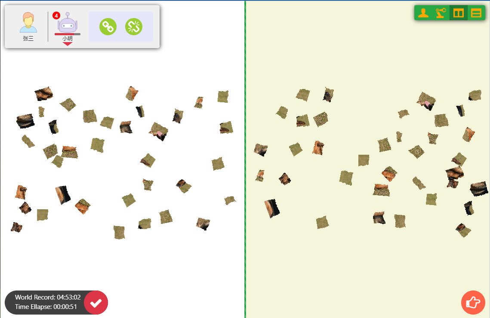

<h1 align="center">Puzzle Game</h1>

  <table>
    <tr>
      <td colspan="3"><h3> - How To Run</h3></td>
    </tr>
    <tr>
      <td colspan="3">
        <table>
          <td></td>
          <td></td>
        <table>
      </td>
    </tr>
    <tr>
      <td colspan="3"><h3> - Game Introduction</h3></td>
    </tr>
    <tr>
      <td colspan="3"><h4> Single player </h4></td>
    </tr>
    <tr>
      <td></td>
      <td></td>
      <td></td>
    </tr>
    <tr>    
      <td></td>
      <td></td>
      <td></td>
    </tr>
    <tr>
      <td colspan="6"><h4> Multiple player(with bot) </h4></td>
    </tr>
    <tr>
      <td></td>
      <td></td> 
      <td></td> 
    </tr>
  </table>

