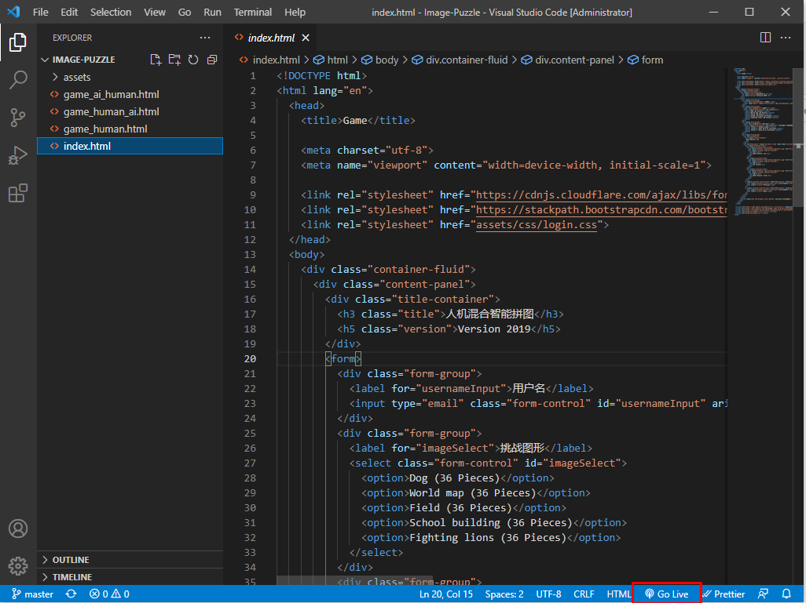
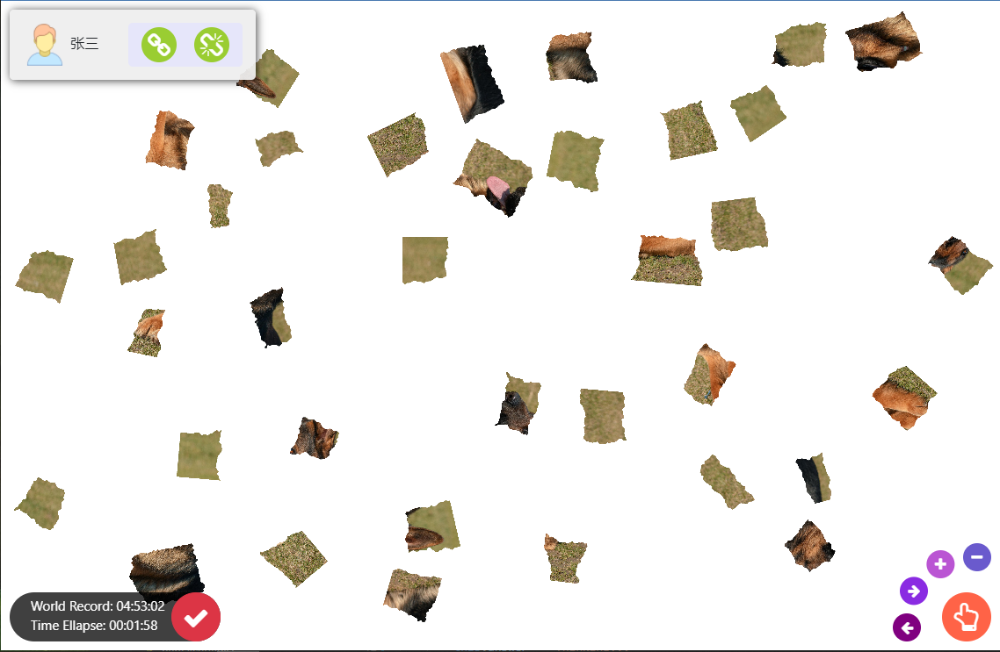
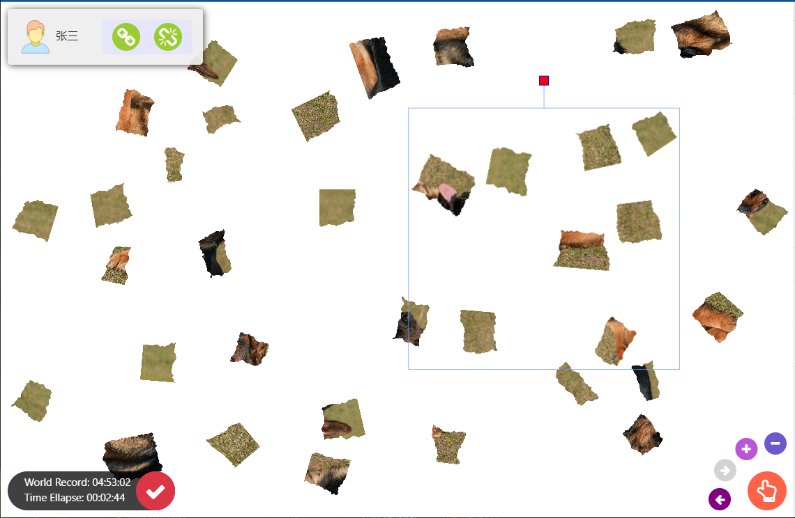
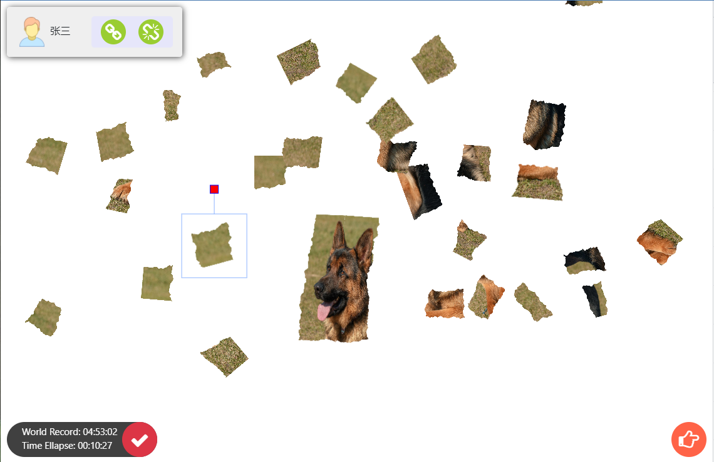
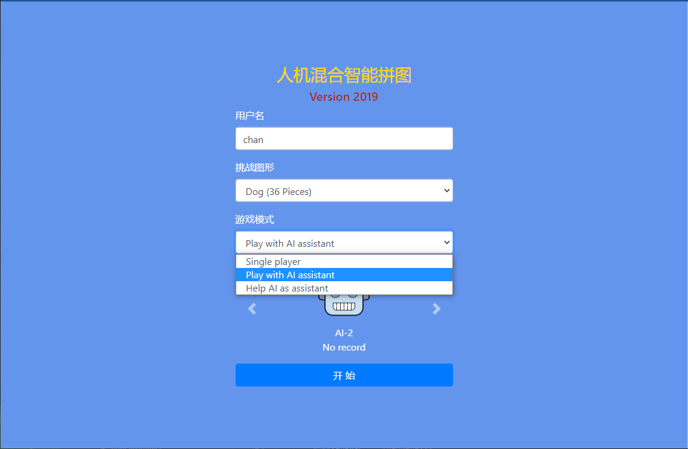

<h1 align="center">Puzzle Game</h1>

  <table>
    <tr>
      <td colspan="6"><h3> - How To Run</h3></td>
    </tr>
    <tr>
      <td colspan="3"></td>
      <td colspan="3"></td>
    </tr>
    <tr>
      <td colspan="6"><h3> - Game Introduction</h3></td>
    </tr>
    <tr>
      <td colspan="6"><h4> Single player </h4></td>
    </tr>
    <tr>
      <td colspan="2"></td>
      <td colspan="2"></td>
      <td colspan="2"></td>
    </tr>
    <tr>    
      <td colspan="2"></td>
      <td colspan="2"></td>
      <td colspan="2"></td>
    </tr>
    <tr>
      <td colspan="6"><h4> Multiple player(with bot) </h4></td>
    </tr>
    <tr>
      <td colspan="2"></td>
      <td colspan="2"></td> 
      <td colspan="2"></td> 
    </tr>
  </table>

